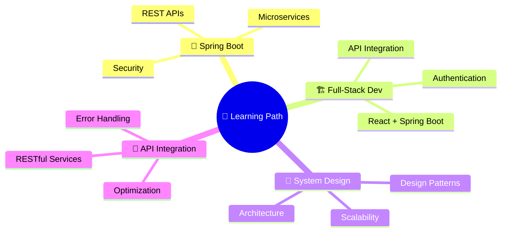

<!-- Header Banner with Wave Animation -->
<div align="center">
  
  
</div>
<!-- Typing Animation -->
<div align="center">
  
  [](https://git.io/typing-svg)
</div>
<!-- Animated Divider -->

<!-- About Me Section -->
<h2>
 
  &nbsp;About Me
</h2>

```yaml
name: Amlan Bhowmik
role: Frontend Developer
location: India
education: Computer Science
current_focus:
  - "🔭 Building AMC e-Billing Workflow System"
  - "🌱 Learning Spring Boot & System Design"
  - "💡 Exploring Full-Stack Architecture"
  - "🎯 Crafting Production-Ready Apps"
fun_facts:
  - "⚡ I turn coffee into code"
  - "🎨 Pixel-perfect is my mantra"
  - "🚀 Always shipping, always learning"
```
<br clear="both">
<!-- Animated Divider -->

<!-- Current Project Section -->
<h2>
  
  &nbsp;Featured Project
</h2>
<div align="center">
<table>
<tr>
<td width="50%">
### 🏗️ AMC e-Billing Workflow Management
<p>
  
  
  
</p>
A comprehensive **React-based workflow management** application for streamlined business operations.
**Key Modules:**
|
 Module 
|
 Description 
|
|
--------
|
------------
|
|
 📋 Work Orders 
|
 Create & manage work assignments 
|
|
 📄 Challans 
|
 Track delivery documents 
|
|
 💰 Bills 
|
 Automated billing workflows 
|
|
 ✅ Sanction Memos 
|
 Approval management system 
|
|
 💳 Payments 
|
 End-to-end payment processing 
|
</td>
</tr>
</table>
</div>
<!-- Animated Divider -->

<!-- Tech Stack Section -->
<h2>
  
  &nbsp;Tech Stack & Tools
</h2>
<div align="center">
### 🎨 Frontend
<p>
  <a href="https://react.dev/">
    
  </a>
  <a href="https://developer.mozilla.org/en-US/docs/Web/JavaScript">
    
  </a>
  <a href="https://developer.mozilla.org/en-US/docs/Web/HTML">
    
  </a>
  <a href="https://developer.mozilla.org/en-US/docs/Web/CSS">
    
  </a>
  <a href="https://axios-http.com/">
    
  </a>
</p>
### ⚙️ Backend
<p>
  <a href="https://spring.io/projects/spring-boot">
    
  </a>
  <a href="https://www.java.com/">
    
  </a>
</p>
### 🗄️ Database
<p>
  <a href="https://www.mysql.com/">
    
  </a>
</p>
### 🛠️ Tools & Platforms
<p>
  <a href="https://git-scm.com/">
    
  </a>
  <a href="https://github.com/">
    
  </a>
  <a href="https://about.gitlab.com/">
    
  </a>
  <a href="https://code.visualstudio.com/">
    
  </a>
  <a href="https://www.postman.com/">
    
  </a>
</p>
</div>
<!-- Animated Divider -->

<!-- GitHub Stats Section -->
<h2>
  
  &nbsp;GitHub Analytics
</h2>
<div align="center">
  
  
</div>
<br>
<div align="center">
  
</div>
<br>
<!-- Activity Graph -->
<div align="center">
  
  [](https://github.com/YOUR_GITHUB_USERNAME)
</div>
<!-- Animated Divider -->

<!-- Currently Learning Section -->
<h2>
  
  &nbsp;Currently Learning
</h2>
<div align="center">

</div>
<!-- Animated Divider -->

<!-- Goals Section -->
<h2>
  
  &nbsp;2026 Goals
</h2>
<div align="center">
|
 🎯 Goal 
|
 📊 Progress 
|
|
---------
|
------------
|
|
 Build Production-Ready Apps 
|
  
|
|
 Master Frontend Architecture 
|
  
|
|
 Create Scalable Business Apps 
|
  
|
|
 Consistent Contributions 
|
  
|
|
 Learn Spring Boot 
|
  
|
</div>
<!-- Animated Divider -->

<!-- Connect Section -->
<h2>
  
  &nbsp;Let's Connect
</h2>
<div align="center">
  <a href="https://linkedin.com/in/YOUR_LINKEDIN">
    
  </a>
  <a href="mailto:YOUR_EMAIL">
    
  </a>
  <a href="https://github.com/YOUR_GITHUB_USERNAME">
    
  </a>
</div>
<br>
<!-- Snake Animation -->
<div align="center">
  
  
</div>
<!-- Profile Views Counter -->
<div align="center">
  
  
  
</div>
<!-- Footer Wave -->

<div align="center">
  
  ### ⭐ From [Amlan Bhowmik](https://github.com/YOUR_GITHUB_USERNAME) — Thanks for visiting! 🚀
  
  <i>"Code is like humor. When you have to explain it, it's bad."</i>
  
</div>
